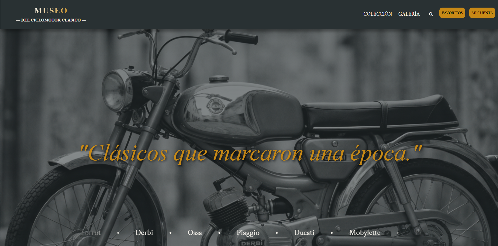

# Museo del Ciclomotor Clásico

Aplicación web desarrollada para la gestión y visualización de ciclomotores clásicos.  
El proyecto permite almacenar, consultar y administrar información relacionada con modelos históricos de ciclomotores mediante una interfaz web conectada a una base de datos MySQL.

---

## Vista previa



---

## Tecnologías utilizadas

| Tecnología | Descripción |
|---|---|
| PHP 8.2 | Lógica del servidor |
| MySQL / MariaDB | Base de datos |
| JavaScript | Interactividad frontend |
| HTML5 & CSS3 | Estructura y estilos |
| Docker | Contenedorización |
| Docker Compose | Orquestación de servicios |
| Adminer | Gestión visual de base de datos |

---

## Arquitectura Docker

El proyecto se ejecuta mediante tres contenedores:

- **mi-php** → Servidor Apache + PHP 8.2
- **mi-mariadb** → Base de datos MariaDB
- **mi-adminer** → Administrador web de bases de datos

---

## Requisitos previos

Antes de ejecutar el proyecto necesitas tener instalado:

- Docker
- Docker Compose

---

## Instalación y ejecución

### 1. Clonar el repositorio

```bash
git clone https://github.com/tu-usuario/tu-repositorio.git
cd tu-repositorio
```

### 2. Levantar los contenedores

```bash
docker compose up -d --build
```
